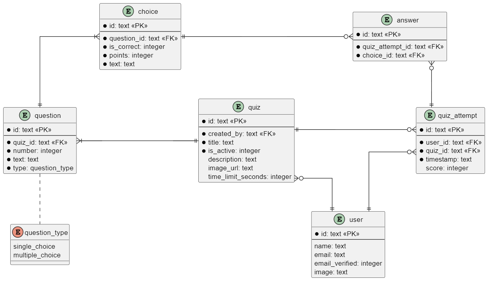

# Quizeek development

## Shadcn

New shadcn components can be added like so:

```
$ pnpm ui:add <component>
```

## Database

Dev DB can be started like so:

```
$ pnpm run db:start:dev
```

Dev DB can be synchronized with current schema like so:

```
$ pnpm run db:push:dev
```

DB studio can be launched like so:

```
$ pnpm run db:studio:dev
```

## Dev .env example

```
DATABASE_URL=http://localhost:8080
AUTH_TOKEN=DOES_NOT_MATTER
```

## Design



## Obtaining auth session
Every route starting with `/auth` will requires authorization and so checking if user is logged in is not required. `authorized` callback is implemented in [src/auth.ts](./src/auth.ts).

### Server
```ts
const session = await auth();

// checking if user is logged in
if (!session?.user) {
    ...
}
```

### Client
```ts
const session = useSession();
```